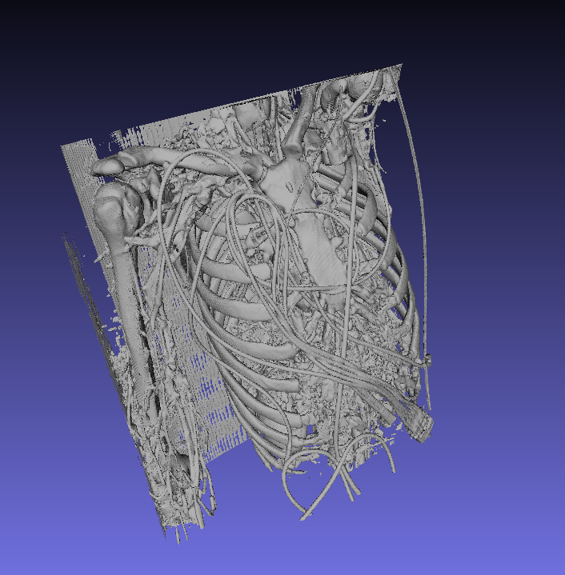

# Examples


# NRRD Data

The file for this example can be found here: [http://www.slicer.org/slicerWiki/images/0/00/CTA-cardio.nrrd](http://www.slicer.org/slicerWiki/images/0/00/CTA-cardio.nrrd)

```

using FileIO
using NRRD
using Meshing
using MeshIO
using GeometryTypes

# load the file as an AxisArray
ctacardio = load("CTA-cardio.nrrd")

# convert AxisArray to SignedDistanceField
ctasdf = SignedDistanceField(HyperRectangle(Vec(0,0,0), Vec(10,10,10)),ctacardio.data)

# use marching cubes with iso at 100
algo = MarchingCubes(iso=100, insidepositive=true)

# generate the mesh using marching cubes
mc = HomogenousMesh{Point{3,Float32},Face{3,Int}}(ctasdf, algo)

# save the file as a PLY file
save("ctacardio_mc.ply", mc)
```


