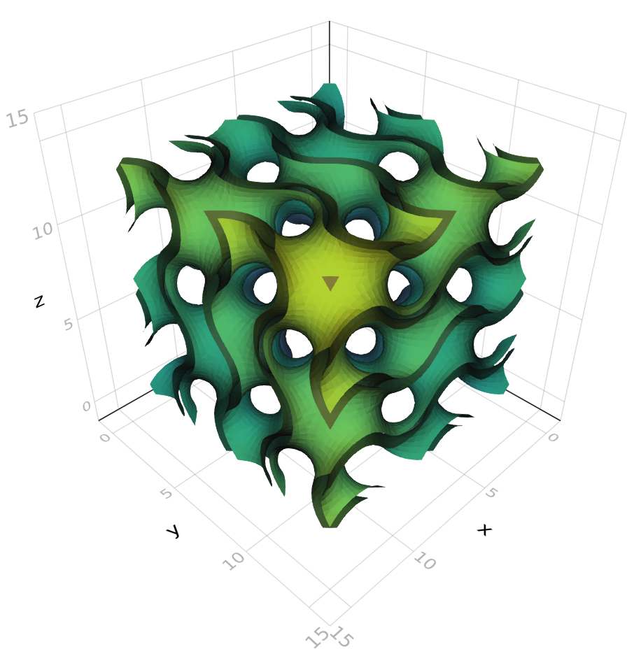

# Examples

## NRRD Data

The file for this example can be found here: [http://www.slicer.org/slicerWiki/images/0/00/CTA-cardio.nrrd](http://www.slicer.org/slicerWiki/images/0/00/CTA-cardio.nrrd)

```julia

using FileIO
using NRRD
using Meshing
using MeshIO
using GeometryBasics

# load the file as an AxisArray
ctacardio = load(Downlaods.)

# use marching cubes with isolevel at 100
algo = MarchingCubes(iso=100, insidepositive=true)
# use marching tetrahedra with iso at 100
# algo = MarchingTetrahedra(iso=100, insidepositive=true)
# use Naive Surface Nets with iso at 100
# algo = NaiveSurfaceNets(iso=100, insidepositive=true)

# generate the mesh using marching cubes
mc = Mesh(ctacardio, algo)

# we can call isosurface to get a vector of points and vector of faces indexing to the points
# vertices, faces = isosurface(ctacardio, algo, Point{3,Float32}, TriangleFace{Int})

# save the file as a PLY file (change extension to save as STL, OBJ, OFF)
save("ctacardio_mc.ply", mc)
```


## Functions

```julia
using Meshing
using FileIO # MeshIO should also be installed
using GeometryBasics

gyroid(v) = cos(v[1])*sin(v[2])+cos(v[2])*sin(v[3])+cos(v[3])*sin(v[1])
gyroid_shell(v) = max(gyroid(v)-0.4,-gyroid(v)-0.4)

# generate directly using GeometryBasics API
# Rect specifies the sampling intervals
gy_mesh = Mesh(gyroid_shell, Rect(Vec(0,0,0),Vec(pi*4,pi*4,pi*4)),
                       MarchingCubes(), samples=(50,50,50))

save("gyroid.ply", gy_mesh)

# view with Makie
import Makie
using LinearAlgebra
Makie.mesh(gy_mesh, color=[norm(v) for v in coordinates(gy_mesh)])
```




```julia
using Meshing
using GeometryBasics
using LinearAlgebra: dot, norm
using FileIO

# Mesh an equation of sphere in the Axis-Aligned Bounding box starting
# at -1,-1,-1 and widths of 2,2,2 using Marching Cubes
m = GLNormalMesh(Rect(Vec(-1,-1,-1.), Vec(2,2,2.)), MarchingCubes()) do v
    sqrt(sum(dot(v,v))) - 1
end

# save the Sphere as a PLY file
save("sphere.ply",m)
```

For a full listing of concrete `AbstractMesh` types see [GeometryBasics.jl mesh documentation](http://juliageometry.github.io/GeometryBasics.jl/latest/types.html#Meshes-1).

Alternatively, we can use the `isosurface` API to sample a function:

```julia
using Meshing
using LinearAlgebra
using StaticArrays

points, faces = isosurface(origin=SVector(-1,-1,-1.), widths = SVector(2,2,2.), samples = (40,40,40)) do v
    sqrt(sum(dot(v,v))) - 1
end

# by default MarchingCubes() is used, but we may specify a different algorithm as follows

points, faces = isosurface(MarchingTetrahedra(), origin=SVector(-1,-1,-1.), widths = SVector(2,2,2.), samples = (40,40,40)) do v
    sqrt(sum(dot(v,v))) - 1
end
```
